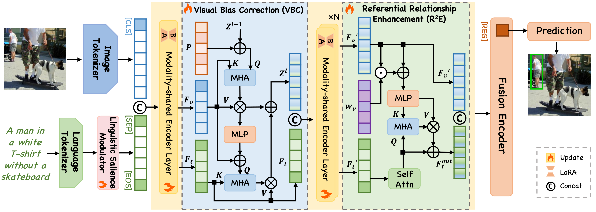
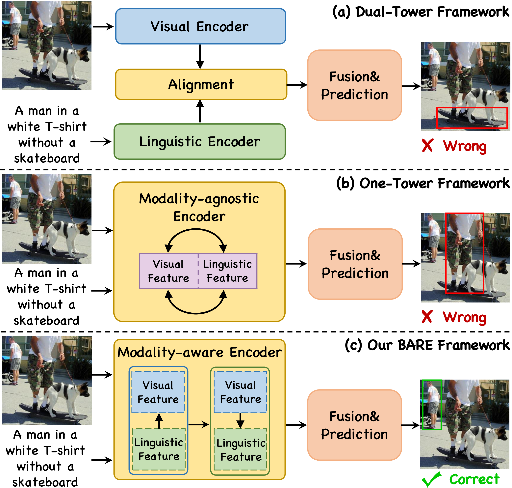
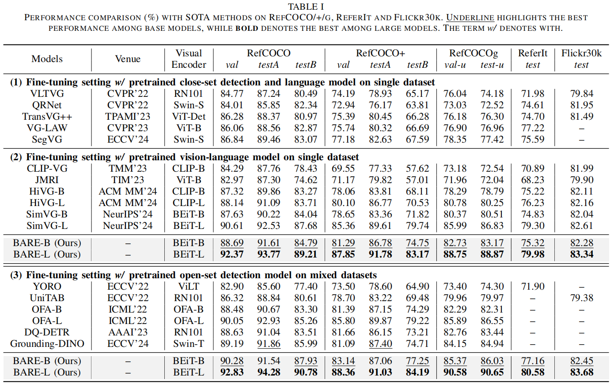
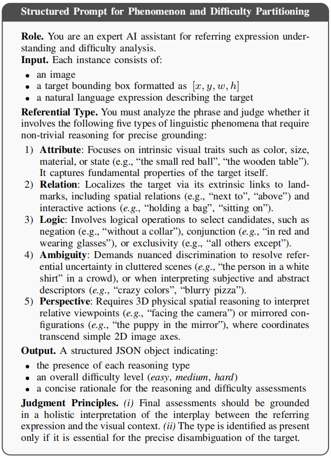
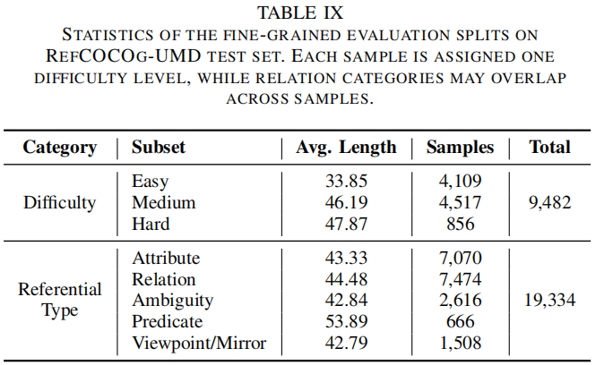
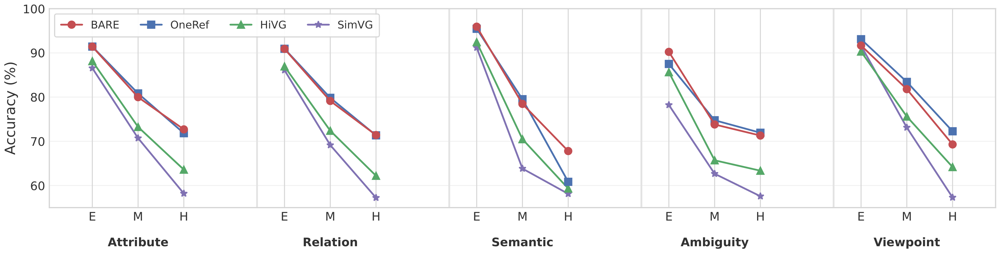
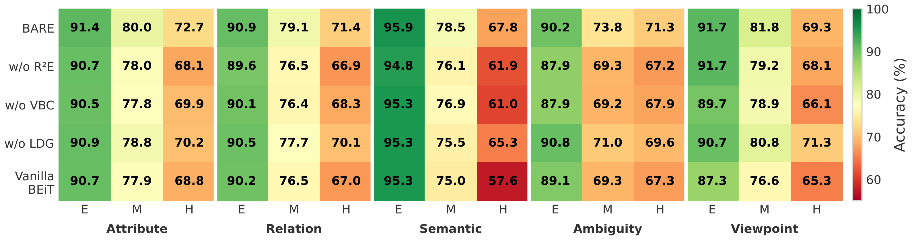
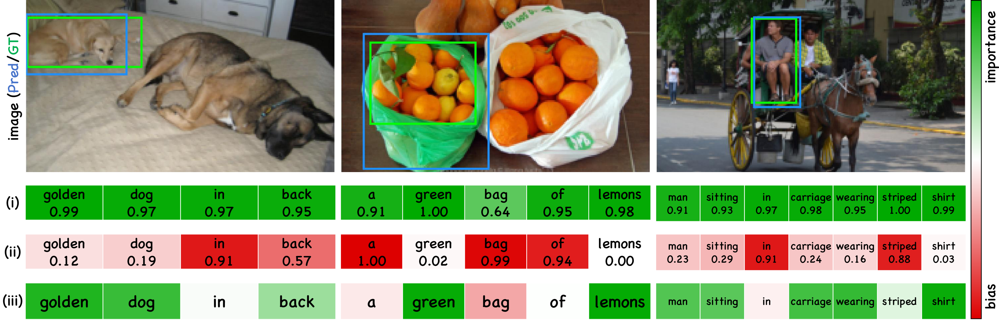

[//]: # (<br />)
<p align="center"> <h1 align="center">BARE: Towards Bias-Aware and Reasoning-Enhanced <br>One-Tower Visual Grounding</h1>

<p align="center">  </p>

## 📖 Contents

1. [✨ Highlights](#-highlights)
2. [📌 Introduction](#-introduction)
3. [🛠️ Usage](#️-usage)
4. [🚀 Results](#-results)
5. [🔍 Further Remark](#-further-remark)
6. [🖼️ Visualization](#️-visualization)

## ✨ Highlights

- **🎯 Precise and Efficient One-Tower Architecture**  
  Proposes the **BARE** framework, specifically designed to address the "over-entangled representations" bottleneck in one-tower visual grounding, achieving deep cross-modal interaction while maintaining superior reasoning efficiency.

- **🛡️ Bias-Aware and Robust Referential Reasoning**  
  Utilizes **LSM**, **VBC**, and **R2E** modules to effectively suppress visual artifacts and linguistic shortcuts, significantly enhancing the model's reasoning capability for complex logical references and fine-grained semantic dependencies.

- **⚡ State-of-the-Art Performance and Rigorous Experimental Validation**  
  BARE consistently sets new performance benchmarks across **five large-scale datasets** (RefCOCO/+/g, ReferIt, Flickr30K) under multiple experimental settings. Our comprehensive evaluation—including exhaustive ablation studies and multi-granularity comparisons—provides compelling empirical evidence of the framework's superior precision, robustness, and generalizability. 

- **📊 Fine-Grained Partitioning and Open-Source Resource**  
  Leverages LLMs to systematically re-partition the **RefCOCOg** test set into multi-dimensional categories, enabling a comprehensive analysis of linguistic and visual patterns. BARE demonstrates exceptional robustness across these fine-grained splits, which are now publicly available on [Hugging Face](https://huggingface.co/datasets/marloweee/BARE_grefumd_test_partitioning).

  <p align="center">  </p>

## 📌 Introduction

**Visual Grounding**, which aims to localize image regions referred to by natural language expressions, is a fundamental yet challenging task in multimodal understanding.

While recent grounding transfer works have advanced the field through **one-tower architectures**, they still suffer from two primary limitations:  
*(1)* **Over-entangled multimodal representations** that exacerbate deceptive visual biases, and  
*(2)* **Insufficient semantic reasoning** that hinders the comprehension of referential cues.

In this paper, we propose **BARE**, a **bias-aware and reasoning-enhanced** framework for one-tower visual grounding.  
BARE introduces a mechanism that preserves **modality-specific features** and constructs **referential semantics** through three novel modules:  
*(i)* *Linguistic Salience Modulator (LSM)*,  
*(ii)* *Visual Bias Correction (VBC)*, and  
*(iii)* *Referential Relationship Enhancement (R2E)*,  
which jointly mitigate visual distractions and enhance referential comprehension.

Extensive experimental results on **five benchmarks** demonstrate that **BARE not only achieves state-of-the-art performance**, but also delivers **superior computational efficiency** compared to existing approaches.

> 🔓 *The full code will be publicly accessible after acceptance.*

<p align="center">  </p>
<p align="center"> <b></b> Visualization of layer-wise attention maps and grounding results from BEiT-3 and our proposed method. BARE effectively filters out deceptive visual shortcuts and progressively refines its focus toward the intended referent, leading to more precise and robust grounding under challenging conditions. </p>

## 🛠️ Usage

<details open>
<summary><font size="4">
Dependencies
</font></summary>

- Python 3.9
```bash
conda create -n BARE python=3.9
conda activate BARE
```
- Pytorch 2.2.2 <br> Select the following command for your CUDA version:
```bash
pip install torch==2.2.2 torchvision==0.17.2 torchaudio==2.2.2 --index-url https://download.pytorch.org/whl/cu118
# or 
pip install torch==2.2.2 torchvision==0.17.2 torchaudio==2.2.2 --index-url https://download.pytorch.org/whl/cu121
```
- Check [requirements.txt](requirements.txt) for other dependencies. 
```bash
pip install -r requirements.txt
```
- It is recommended to run the code under an Anaconda environment. If a library is missing, you can simply install it using `pip install <library_name>` or `conda install <library_name>`.

Our model is **easy to deploy** in a variety of environments and **has been successfully tested** on multiple PyTorch versions.

</details>

<details open>
<summary><font size="4">
Image Data Preparation
</font></summary>

1. The images used in BARE include the following parts. You can download the images from the original sources and place them in your disk folder:
 
- [MS COCO 2014](download_mscoco2014.sh) (for RefCOCO, RefCOCO+, RefCOCOg datasets, ~13GB) 
- [ReferItGame](https://drive.google.com/drive/folders/1D4shieeoKly6FswpdjSpaOrxJQNKTyTv)
- [Flickr30K Entities](http://shannon.cs.illinois.edu/DenotationGraph/#:~:text=make%20face-,Downloads,-Please%20fill%20in)

Please place the data or the soft link of the dataset folder under `./ln_data/.` We follow the dataset structure of DMS. To accomplish this, the [download_data.sh](./ln_data/download_data.sh) bash script from DMS can be used.
```bash
cd ./ln_data
bash download_data.sh --path . 
```
Alternatively, you can follow the data preparation of TransVG in [GETTING_STARTED.md](https://github.com/djiajunustc/TransVG/blob/main/docs/GETTING_STARTED.md).

Only the image data in these datasets is used. These images are easily found in similar repositories of visual grounding work, such as [TransVG](https://github.com/linhuixiao/TransVG). 
Finally, the `./ln_data` folder should have the following structure:

```text
|--ln_data
   |-- Flickr30k
      |-- flickr30k-images
   |-- other
      |-- images
        |-- mscoco
            |-- images
                |-- train2014
   |-- referit
      |-- images
```
- `./ln_data/Flickr30k/flickr30k-images/`: Image data for the Flickr30K dataset.
- `./ln_data/other/images/`: Image data for RefCOCO/RefCOCO+/RefCOCOg (mscoco2014). 
- `./ln_data/referit/images/`: Image data for ReferItGame.

</details>

<details open>
<summary><font size="4">
Annotation Data Preparation
</font></summary>

Please download the data indices from [[Google Drive]](https://drive.google.com/file/d/1fVwdDvXNbH8uuq_pHD_o5HI7yqeuz0yS/view?usp=sharing) and place them in the `./data` folder.

```bash
rm -r ./data
tar -xvf data.tar
```

The directory structure will be:

```text
|-- data
    ├── referit
    │   ├── referit_test.pth
    │   ├── referit_train.pth
    │   └── referit_val.pth
    ├── flickr
    │   ├── flickr_test.pth
    │   ├── flickr_train.pth
    │   └── flickr_val.pth
    ├── unc
    │   ├── unc_testA.pth
    │   ├── unc_testB.pth
    │   ├── unc_train.pth
    │   └── unc_val.pth
    ├── unc+
    │   ├── unc+_testA.pth
    │   ├── unc+_testB.pth
    │   ├── unc+_train.pth
    │   └── unc+_val.pth
    ├── gref_umd
    │   ├── gref_umd_test.pth
    │   ├── gref_umd_train.pth
    │   └── gref_umd_val.pth
    └── mixup
        ├── mixup_test.pth
        ├── mixup_train.pth
        └── mixup_val.pth
```
</details>

<details open>
<summary><font size="4">
Pre-trained Checkpoints
</font></summary>

1. Checkpoints for [BEiT-3](https://arxiv.org/pdf/2208.10442) include Base and Large models, pre-trained on ImageNet-21k, 160GB of text, and web-scale image-text pairs (LAION-400M, LAION-2B, COYO-700M, and CC15M). 
   - [`BEiT3-base-indomain`](https://github.com/addf400/files/releases/download/beit3/beit3_base_indomain_patch16_224.pth): #layer=12; hidden=768; FFN factor=4x; #head=12; patch=16x16; #parameters: 276M
   - [`BEiT3-large-indomain`](https://github.com/addf400/files/releases/download/beit3/beit3_large_indomain_patch16_224.pth): #layer=24; hidden=1024; FFN factor=4x; #head=16; patch=16x16; #parameters: 746M

2. Text Tokenizer
[beit3.spm](https://github.com/addf400/files/releases/download/beit3/beit3.spm) is the sentencepiece model used for tokenizing text.
```python
from transformers import XLMRobertaTokenizer
tokenizer = XLMRobertaTokenizer("/your_beit3_model_path/beit3.spm")
```
3. Save downloaded checkpoints in `./weights` as follows:
```text
|-- weights 
    ├── beit3_base_indomain_patch16_224.pth
    │── beit3_large_indomain_patch16_224.pth
    └── beit3.spm
```

</details>

<details open>
<summary><font size="4">
Training and Evaluation
</font></summary>

1. Download images, text annotations, and the pre-trained BEiT-3 model. 

2. Training and evaluation scripts are provided for all major datasets:
    ```text
    |-- train_and_eval_script
        ├── referit_base.sh / referit_large.sh
        ├── flick30k_base.sh / flick30k_large.sh
        ├── unc_base.sh / unc_large.sh
        ├── unc+_base.sh / unc+_large.sh
        ├── grefumd_base.sh / grefumd_large.sh
        └── mixup_base.sh / mixup_large.sh
    ```

3. We recommend using the provided scripts for streamlined training and evaluation:
    ```bash
    # Example: Training on RefCOCO with Base model
    bash train_and_eval_script/unc_base.sh
    ```
</details>

## 🚀 Results

### RefCOCO, RefCOCO+, RefCOCOg, ReferIt, and Flickr30K datasets

<details open>
<summary><font size="4">
Performance Comparison
</font></summary>
<p align="center">  </p>


We evaluate **BARE** against state-of-the-art methods on RefCOCO/+/g, ReferIt, and Flickr30k under three settings:

1. **Backbone-based Fine-tuning:** While detector-based methods (e.g., SegVG) are competitive, BARE significantly outperforms them by leveraging pre-trained vision-language representations.
2. **Pre-trained VL Model Fine-tuning:** **BARE-B** achieves the best base-model performance, surpassing SimVG-B by **0.75%**, **2.93%**, and **2.66%** on RefCOCO/+/g (testB/testB/test-u). **BARE-L** sets new SOTA for large models, reaching **79.98/83.34** on ReferIt/Flickr30k.
3. **Data-Mixed Pre-training:** BARE remains superior under data-rich settings, with **BARE-B** improving over Grounding DINO by up to **2.54%** and **BARE-L** outperforming OFA-L by up to **5.52%** on key benchmarks.
</details>

## 🔍 Further Remark

<details open>
<summary><font size="4">
Data Management
</font></summary>

To move beyond aggregate metrics and diagnose systematic bottlenecks, we introduce a **fine-grained evaluation protocol** on the RefCOCOg test set. Samples are re-partitioned along two key axes:
- **Difficulty Levels**: Easy, Medium, and Hard.
- **Reference Types**: Attribute, Relation, Logic, Ambiguity, and Perspective.

This partitioning is achieved through an **automated strategy** powered by **Gemini 2.5 Pro**, which parses each image-query pair using a structured prompt template to ensure a traceable and reproducible benchmark.

<p align="center">  </p>


Specifically, the 9,482 samples within the RefCOCOg test set are systematically decomposed into 19,334 fine-grained linguistic pattern instances. This multi-dimensional categorization serves as a rigorous diagnostic framework to evaluate module-level robustness and analyze performance variance across diverse and challenging linguistic phenomena. The detailed distribution of these evaluation splits is summarized below:

<p align="center">  </p>


> ✅ *The fine-grained evaluation splits are publicly accessible on [Hugging Face](https://huggingface.co/datasets/marloweee/BARE_grefumd_test_partitioning).*

</details>

<details open>
<summary><font size="4">
Different Approaches Analysis
</font></summary>
<p align="center">  </p>

- **Superior Robustness Across Difficulties:** BARE achieves SOTA performance on both Easy (90.73%) and Hard (71.69%) subsets of RefCOCOg, maintaining high precision as semantic complexity increases.
- **Enhanced Reasoning for Challenging Phenomena:** While maintaining competitive results on Attribute and Relation types, BARE delivers pronounced improvements in **Logic** and **Ambiguity** cases. 
- **Effectiveness of VBC & R²E:** These gains are attributed to the VBC module's capacity to suppress deceptive visual shortcuts and the R²E module's strength in reinforcing high-level referential reasoning and structured semantics.
</details>

<details open>
<summary><font size="4">
Different Modules Analysis
</font></summary>
<p align="center">  </p>

- **Linguistic Salience Modulator (LSM):** Mitigates language-side bias and filters high-frequency shortcuts at the input stage, enhancing the quality of referential cues before shared encoding.
- **Synergistic Bias Correction & Reasoning (VBC & R²E):** VBC recalibrates visual attention to suppress deceptive shortcuts, while R²E reinforces compositional reasoning over structured relations and logical constraints.
</details>


## 🖼️ Visualization

<details open>
<summary><font size="4">
Layer-wise Attention of VBC and R²E
</font></summary>
<p align="center">  </p>

- **Visual Bias Correction (VBC):** Effectively refocuses attention from defocused maps onto the primary subject, maintaining stable target awareness and high-intensity activation across layers.
- **Referential Relationship Enhancement (R²E):** Precisely eliminates irrelevant distractions and refines complex semantic dependencies at the final stage, leading to sharp and accurate localization.
- **Suppression of Deceptive Shortcuts:** These mechanisms jointly suppress visual/linguistic shortcuts and reinforce genuine referential cues, ensuring robust performance under challenging conditions.
</details>

<details open>
<summary><font size="4">
Token-wise Attention of LSM
</font></summary>
<p align="center">  </p>

- **Functional Synergy of LSM:** LSM operates through (i) a **referential importance gate** that highlights critical semantic cues (e.g., attributes and relations) and (ii) a **bias degree gate** that suppresses deceptive linguistic shortcuts.
- **Logic-Driven Refinement:** The final weighted result successfully filters redundant noise and accentuates task-relevant tokens, ensuring that cross-modal alignment is driven by genuine referential logic rather than superficial co-occurrences.
</details>

<details open>
<summary><font size="4">
Representative Grounding Results
</font></summary>
<p align="center">  </p>

- **Robust Visual Perception:** Showcases representative results across challenging scenarios, highlighting the model's ability to maintain precise localization in complex environments.
- **Fine-grained Reasoning:** Demonstrates superior spatial and semantic reasoning capabilities, enabling robust performance even in highly ambiguous or cluttered contexts.
</details>